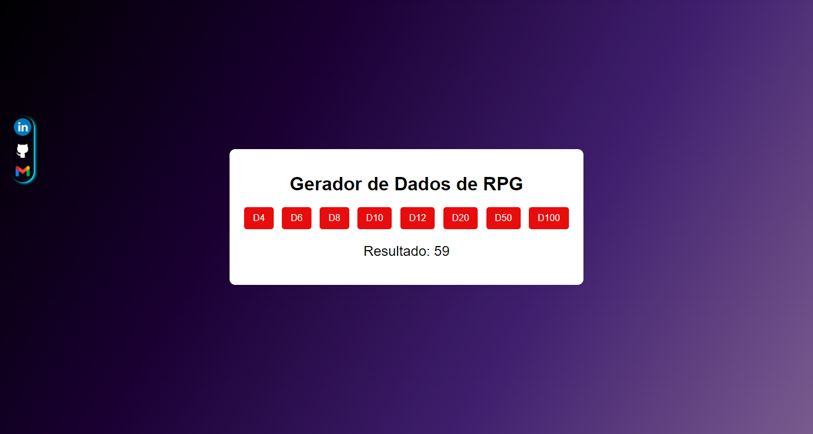

# RollForAdventure
Rolagem de dados RPG

# Rolagem de Dados de RPG

Um gerador de rolagem dados de RPG simples feito com HTML, CSS e JavaScript. Este projeto permite que os usuários lancem dados comuns em RPGs, como D4, D6, D8, D10, D12, D20, D50 e D100 e visualizem os resultados de forma interativa.

## Demonstração

 

## Funcionalidades

- Geração de números aleatórios para diferentes tipos de dados (D4, D6, D8, D10, D12, D20, D50, D100).
- Interface de usuário simples e responsiva.
- Estilização moderna e atraente.

## Tecnologias Usadas

- **HTML**: Estrutura do site.
- **CSS**: Estilização e design.
- **JavaScript**: Lógica para gerar números aleatórios e manipular a interface.

## Como Usar

1. **Clone o repositório** ou faça o download dos arquivos.
   ```bash
   git clone https://github.com/TIAG0MIRANDA/RollForAdventure
